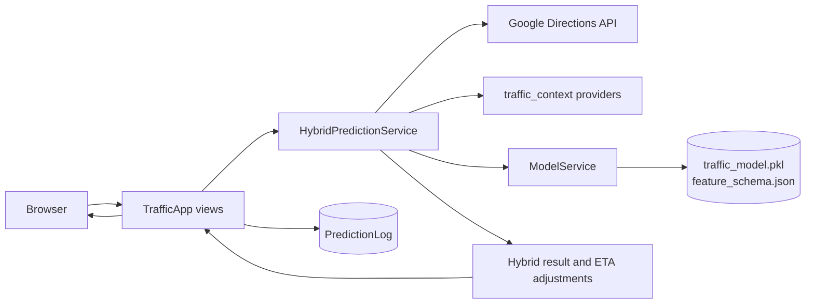
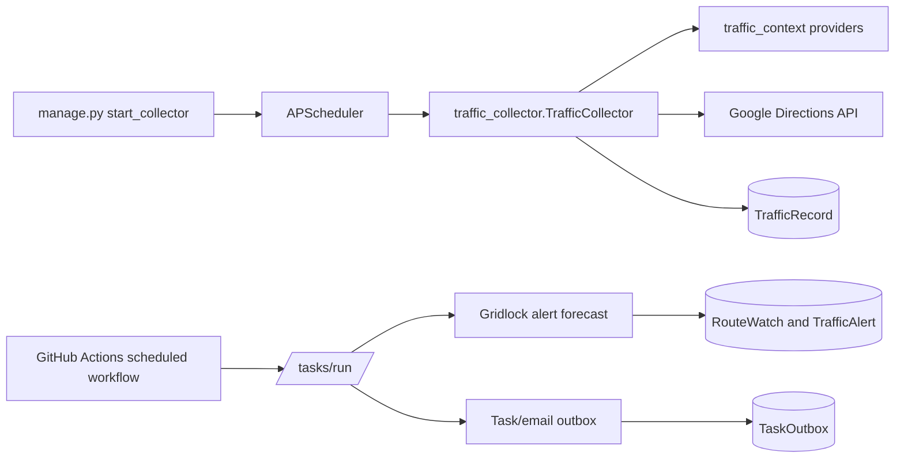

# System architecture

TrafficPro is a Django application with server-rendered pages and JavaScript interactions. The request path, collector, and scheduled jobs share domain code but run through separate entry points.

## Prediction request

`TrafficApp.views.predict_view` validates a route request and delegates prediction work to `TrafficApp.services.hybrid_prediction_service.HybridPredictionService`. The service obtains route metrics from the shared `traffic_context.directions_client` through `GoogleMapsService`, gathers weather/calendar/school/event context, and asks `ModelService` for a model result. It then combines the Google congestion classification, binary model result, and context-based ETA adjustments. A model error falls back to Google’s classification; the model itself only returns Free-flow or Congested, while the UI’s High category can come from Google live traffic.

Successful prediction requests are recorded in `PredictionLog`. The analytics view aggregates collected observations from `TrafficRecord`; its admin usage/funnel panels also use `PredictionLog`, user records, and `AnalyticsEvent`. Current analytics are not read from Supabase.

## Collection and scheduled work

The `start_collector` management command starts a persistent APScheduler process. That scheduler collects traffic records and also runs gridlock-alert and outbox jobs. The checked-in GitHub Actions workflow calls `/tasks/run/`, which runs alert forecasting and outbox processing; it does **not** run traffic collection. These are distinct mechanisms and should be provisioned according to the deployment setup.

`traffic_context/` contains shared context, Directions API, and ML feature code. `traffic_collector/` contains collection persistence and scheduling. `TrafficApp/services/` contains prediction, alerts, email, and outbox services. PostgreSQL is accessed through Django’s ORM using `DATABASE_URL`; Redis is an optional Django cache backend, with local-memory cache used when `REDIS_URL` is absent.

## Main code areas

| Area | Location | Responsibility |
|---|---|---|
| Django configuration and URL dispatch | `TrafficPro/`, `TrafficApp/urls.py` | Settings, project entry points, and application routes |
| Web requests and pages | `TrafficApp/views.py`, `TrafficApp/templates/`, `TrafficApp/static/` | Authentication, prediction, history, analytics, alerts, and rendered UI |
| Prediction services | `TrafficApp/services/hybrid_prediction_service.py`, `google_maps_service.py`, `model_service.py` | Route data, model inference, and hybrid result shaping |
| Shared traffic context and ML features | `traffic_context/` | Directions client, weather/calendar/school/event signals, scoring, and train/serve features |
| Collection and scheduler | `traffic_collector/`, `TrafficApp/management/commands/start_collector.py` | Periodic route collection and worker-side scheduled jobs |
| Persistence | `TrafficApp/models.py`, `TrafficApp/migrations/` | User-linked data, traffic records, prediction logs, alerts, and outbox |
| Deployment automation | `render.yaml`, `.github/workflows/` | Render web service configuration, CI, and scheduled endpoint trigger |

For the database entities, see [DATABASE.md](DATABASE.md). For training and inference, see [ML_PIPELINE.md](ML_PIPELINE.md). For local execution and deployment configuration, see [SETUP.md](SETUP.md) and [DEPLOYMENT.md](DEPLOYMENT.md).
